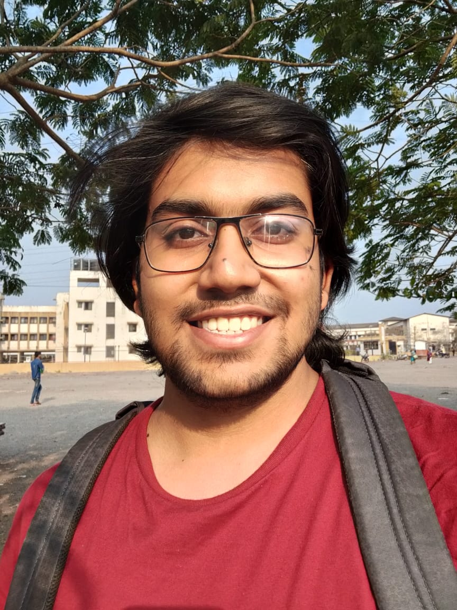

# Mohammad Senan Ali's Profile Page

## Table of contents

1. [About Me](#About-Me)
2. [Education](#Education)
3. [Courses @IITGoa](#Courses-@IITGoa)
4. [Hobbies and Interests](#Hobbies-and-Interests)

## About Me

Hi, my name is Mohammad Senan Ali.
I am a second year student Computer Science and Engineering at IIT Goa

## Education

## Courses @IITGoa
- **CS102** Software Tools *Clint P. George*
- **CS212** Computer Networks *Neha Karanjkar*
- **CS222** Algorithm Design *Rahul CS, Arpita Korwar*
- **ID601** Numerical Simulation *Mantu Santra, Santosh Kumar Das*

## Hobbies and Interests
My hobby is playing chess.
My favourite chess players are
- Gary Kasparov
- Hikaru Nakamura
- Magnus Carlson
- Alireza Firouza

My favourite Quote from Gary Kasparov:
> Being too far ahead of your environment can be just as bad as lagging behind your competitors.
> - Gary Kasparov
